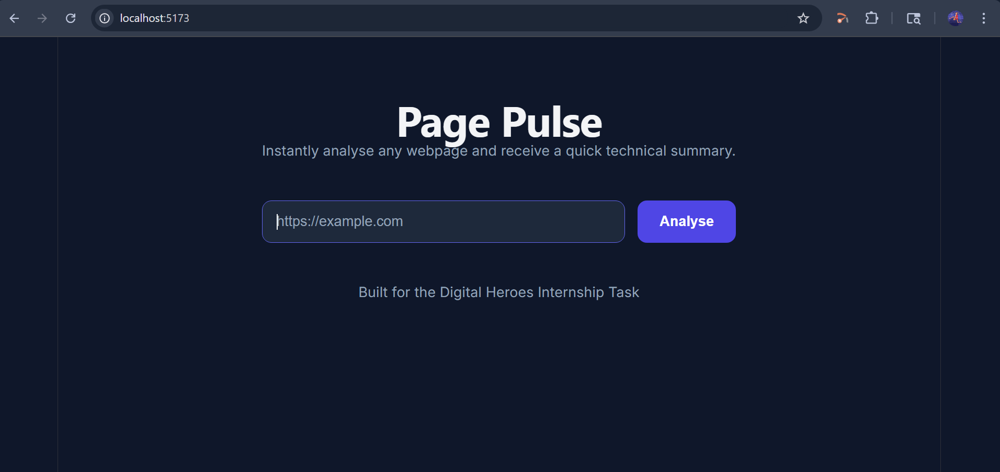
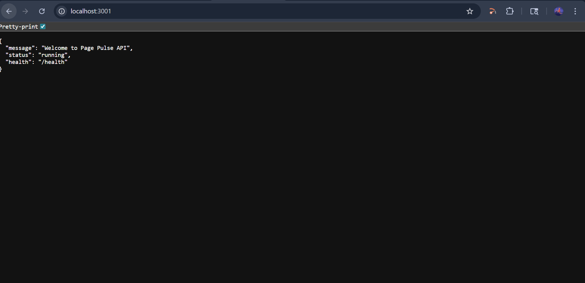
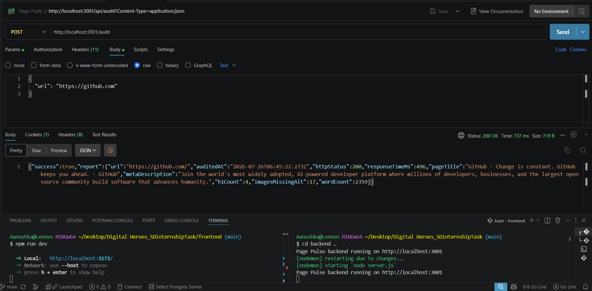
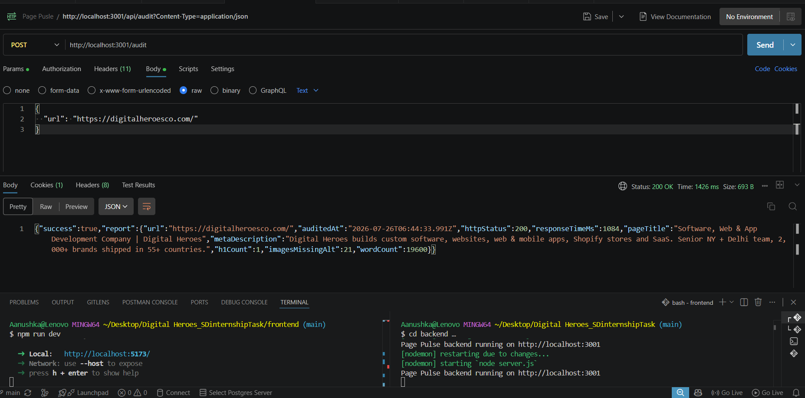
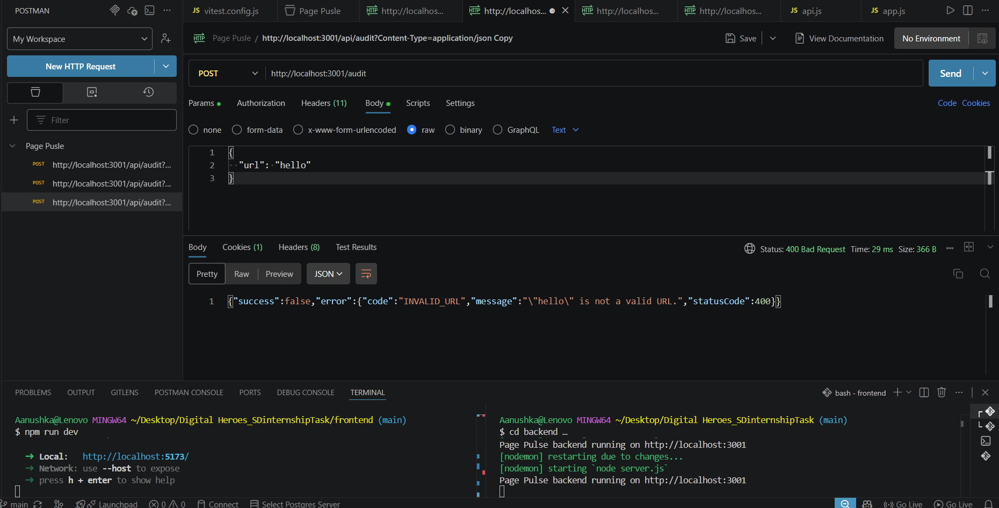

# Page Pulse

Paste a URL, get back an instant audit: HTTP status, response time, page title, meta description, H1 count, images missing alt text, and approximate word count.

Built for the Digital Heroes SDE internship task.

# Page Pulse

Paste a URL, get back an instant audit: HTTP status, response time, page title, meta description, H1 count, images missing alt text, and approximate word count.

Built for the Digital Heroes SDE internship task.

**Live site:** https://digital-heroes-s-dinternship-task.vercel.app/
**API base:** https://digital-heroes-sdinternshiptask.onrender.com


---

## Project Structure
## Project Structure


Digital_Heroes_SDinternshipTask/
├── backend/ Node.js + Express API
│ └── src/
│ ├── config/ Environment configuration
│ ├── middleware/ URL validation + error handling
│ ├── services/ fetchPage, auditPage
│ └── utils/ HTML parsing + typed errors
│
├── frontend/ React + Vite SPA
│ └── src/
│ ├── services/ API communication
│ └── App.jsx Input form, states, report card
│
├── screenshots/ Project screenshots
│ ├── frontend-ui-display.png
│ ├── backend-running.png
│ ├── github-url.png
│ ├── digital-heroes-url.png
│ └── invalid-url-validation.png
│
└── README.md

## Setup

### Backend

```bash
cd backend
cp .env.example .env
npm install
npm run dev
```

Runs on `http://localhost:3001`.

### Frontend

```bash
cd frontend
cp .env.example .env
npm install
npm run dev
```

Runs on `http://localhost:5173`.

## API Contract

### `POST /audit`

**Request**
```json
{ "url": "https://example.com" }
```

**Success — 200 OK**
```json
{
  "success": true,
  "report": {
    "url": "https://example.com/",
    "auditedAt": "2026-07-26T12:00:00.000Z",
    "httpStatus": 200,
    "responseTimeMs": 189,
    "pageTitle": "Example Domain",
    "metaDescription": "",
    "h1Count": 1,
    "imagesMissingAlt": 0,
    "wordCount": 17
  }
}
```

**Error — 4xx/5xx**
```json
{
  "success": false,
  "error": {
    "code": "TIMEOUT",
    "message": "The target URL did not respond within 10 seconds.",
    "statusCode": 504
  }
}
```

| Status | Code | When |
|---|---|---|
| 400 | `INVALID_URL` | Missing URL, malformed URL, or non-http(s) protocol |
| 422 | `NOT_HTML` | Target responds with a non-HTML content type |
| 502 | `DNS_FAILURE` | Domain unreachable or other network-level failure |
| 504 | `TIMEOUT` | Target did not respond within `FETCH_TIMEOUT_MS` |
| 508 | `REDIRECT_LOOP` | Target redirects more than Node's redirect limit |
| 413 | `RESPONSE_TOO_LARGE` | Response body exceeds `MAX_RESPONSE_BYTES` |
| 500 | `INTERNAL_ERROR` | Unexpected server error |

### `GET /health`

Returns `{ status: "ok", uptime, timestamp }`.

## Design Decisions

**1. Native `fetch` over Axios or Got.** Node 18+ ships the Fetch API built in — no extra dependency to audit or update. `AbortController` gives explicit, testable timeout behavior, and `fetch` only throws on network-level failures (not on 4xx/5xx), which is what we want: a target returning 404 is still a valid audit result, not an error.

**2. Cheerio over JSDOM for HTML parsing.** We only need to read static HTML structure — title, meta tags, heading counts, image attributes. JSDOM's main feature (executing page JavaScript) is unnecessary here and is a larger, heavier attack surface for a server that fetches arbitrary third-party URLs. Cheerio's jQuery-style API is fast and makes the extraction code self-documenting.

**3. Scoped the API down to exactly the 7 required fields.** Earlier in development I built out several extra checks (robots.txt, sitemap, Open Graph tags, an SEO score). None of that is in the brief, and a bug I found in the timeout handling for those extra checks — a request could hang indefinitely — convinced me that the added surface area was a real risk, not just extra value. I removed all of it and kept the API to exactly what's specified, which is easier to test fully and easier to stand behind.

## Testing

```bash
cd backend
npm test
```

## Screenshots

### Frontend UI Display




### Backend Server Running




### API Testing (Postman)

#### GitHub URL Audit




#### Digital Heroes URL Audit




#### Invalid URL Validation



## AI Usage

I used Claude as a development assistant throughout this project. It helped me understand the project requirements, review the overall architecture, compare implementation approaches, and identify appropriate design patterns for features such as HTML parsing and testing. I also used it to review my code, explain errors, and suggest potential fixes for issues like redirect-loop detection and timeout handling.

All suggestions were reviewed, implemented, and tested by me before being included in the project. I made the final decisions on the project structure, implementation, debugging, testing, and overall scope to ensure the application met the internship requirements.

## Credits

Built for [Digital Heroes Training Task](https://digitalheroesco.com)